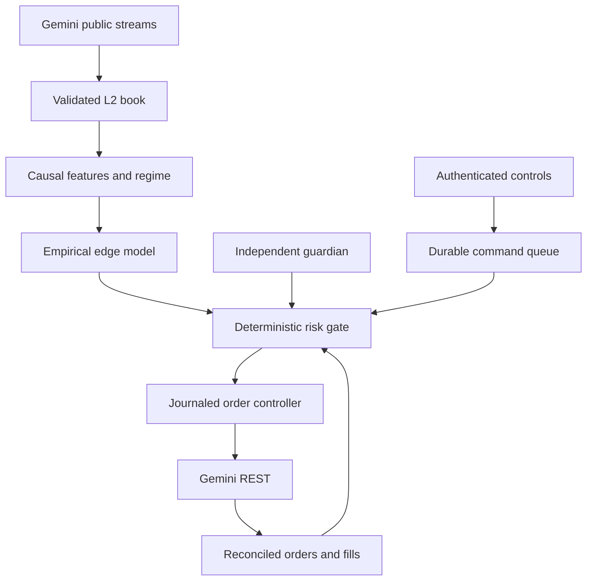

# Architecture and invariants

One Python modular monolith owns strategy state. An independent guardian is a second process only because it must survive a strategy crash. SQLite transactions and file locks coordinate them on the same persistent host.

## Market data

The first differential-depth frame on a `snapshot=-1` subscription initializes the book. Later ranges must cover the next expected update ID. Duplicates never refresh freshness; gaps, invalid quantities, crossing and timestamp regressions invalidate the entire book. A new connection rebuilds from a snapshot. Serious disconnects retain the kill latch until operator recovery.

Exchange timestamps are nanoseconds. Receipt timestamps are recorded separately and drive replay order. Models only use information received by the current decision time. Training labels intentionally use future returns **inside the training partition**, never feature normalization or test labels. Fixed price sampling is independent of decision frequency. Unused diagnostics do not claim predictive value.

## Orders and state

Before a new order touches the network, its client ID and intent are durably recorded. A timeout is **unknown**, not failed. The adapter does not retry creation. Recovery queries the same ID; unresolved absence is a stop requiring operator review. Cancel/status reads can be retried. State is derived from deduplicated exchange fill IDs, not HTTP success or terminal order status.

The position ledger handles weighted entry price, multiple entry fills, multiple partial exits and fees. A trade observation closes only when inventory reaches zero. Fee currency must be USD; unsupported currencies and broken trades halt reconciliation. A fully executed IOC may be reported canceled; quantity and trade records determine its position impact.

All entry and protective orders traverse `RiskEngine.authorize`. The controller does not expose a taker-entry path. Sales cannot exceed reconciled available inventory; no leverage, shorting or averaging-down paths exist. Native stops use the guardian key so entry-key heartbeat cancellation cannot remove protection.

## Emergency behavior

Kill = durable no-new-entry latch + cancellation of risk-increasing orders + attempted reduction of held inventory with a fresh book. Native stops remain if a book is unavailable. With a fresh book, flatten cancels protection before an IOC sale, reconciles, and restores protection on residual inventory. Replacing protection and selling are not exchange-atomic; sandbox failure certification is mandatory.

The guardian does not keep the entry key's heartbeat alive. Entry-session heartbeat cancellation is an exchange setting, configured by the operator. Native stops remain if both local processes stop, but a stop-limit can fail to execute through a price gap. Dust below the exchange minimum and ambiguous history are explicit stops, never treated as a flat account.

## Persistence and scale

SQLite uses WAL, full synchronization, foreign keys, a busy timeout and explicit transactions. Orders/fills/commands have dedicated tables; typed events cover market observations, decisions, equity, health, risk and alerts. State has configuration/code/model fingerprints and persistent loss baselines. JSONL tapes carry manifests; Parquet conversion preserves the parent hash.

This is an auditable first implementation, not a hard-real-time engine. Feature calculation and ledger reconstruction favor correctness and readability. Load-test the intended event rate; queue overflow and processing lag halt trading. Large research captures and repeated walk-forward passes may need a separate research host. A PostgreSQL implementation can replace `Store` without changing domain models, but is not included.

The HTTP dashboard only writes commands; it cannot access exchange credentials or edit risk configuration. Operator tokens, a same-origin POST check, confirmation phrases and loopback host binding protect the local interface. Remote access is over SSH or an independently secured reverse proxy.
